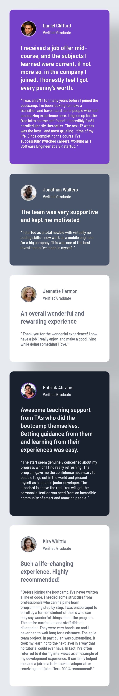
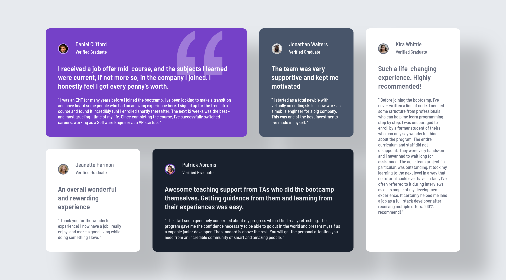

# Frontend Mentor - Testimonials grid section solution

This is a solution to the [Testimonials grid section challenge on Frontend Mentor](https://www.frontendmentor.io/challenges/testimonials-grid-section-Nnw6J7Un7). Frontend Mentor challenges help you improve your coding skills by building realistic projects.

## Table of contents

- [Overview](#overview)
  - [The challenge](#the-challenge)
  - [Screenshot](#screenshot)
  - [Links](#links)
- [My process](#my-process)
  - [Built with](#built-with)
  - [What I learned](#what-i-learned)
  - [Continued development](#continued-development)
  - [AI Collaboration](#ai-collaboration)
- [Author](#author)

## Overview

### The challenge

Users should be able to:

- View the optimal layout for the site depending on their device's screen size

### Screenshot

Mobile:



Desktop:


Desktop, with my custom hover effect on a card:



### Links

- Solution URL: [https://github.com/waleed-thabit/testimonials-grid-section](https://github.com/waleed-thabit/testimonials-grid-section)
- Live Site URL: [https://waleed-thabit.github.io/testimonials-grid-section/](https://waleed-thabit.github.io/testimonials-grid-section/)

## My process

### Built with

- Semantic HTML5 markup
- CSS custom properties
- Flexbox
- CSS Grid
- Mobile-first workflow
- Vanilla HTML and CSS only, no frameworks

### What I learned

- **Centering the main container** took me the most time. The design has empty space on all sides, so I first tried sizing the container with a percentage (`80%`), but it didn't work on every screen size. In the end I centered it with Flexbox on the `body` (`display: flex`, `justify-content: center`, `align-items: center`) with a `min-height`, and I set a `max-width` on `main` so the layout doesn't stretch on large screens.
- **Flexbox in three places:** on the `body` to center the main container, inside each card to center its content, and on the card header.
- **CSS Grid** for the desktop layout: I set the number of columns manually inside a media query, and placed the cards with `grid-column` and `grid-row`.
- **Pseudo-elements:** I used `::before` to show the quotation mark image on the first card, on the desktop layout only. I used it with a CSS `mask`, so I can change the image's color with `background-color` and give it some transparency.

```css
.card-1::before {
  content: "";
  background-color: var(--white);
  mask: url("../assets/images/bg-pattern-quotation.svg") no-repeat center / contain;
  opacity: 30%;
}
```

- **Hover effect (my own addition, not part of the challenge):** each card grows a little with a smooth `transition`, and a higher `z-index` puts the hovered card above the others so its shadow falls on them.

```css
.card-1:hover,
.card-2:hover,
.card-3:hover,
.card-4:hover,
.card-5:hover {
  transform: scale(1.06);
  z-index: 100;
}
```

### Continued development

- Learn the `auto-fit` trick with `minmax()` for Grid, instead of setting the number of columns by hand.
- Improve my responsive design skills in general.

### AI Collaboration

- I used **Gemini** to help me write my Git commit messages.
- I used **Claude** to help me write this README, and to help me with the `mask` trick on the `::before` pseudo-element, so I could change the color of the image I added.

## Author

- GitHub - [@waleed-thabit](https://github.com/waleed-thabit)
- Frontend Mentor - [@waleed-thabit](https://www.frontendmentor.io/profile/waleed-thabit)
